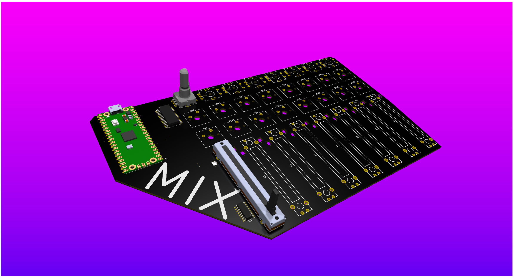

# Mix
A multipurpose audio-focused console

## Why
I find myself constantly tuning my audio mix from different apps through windows, and would like a panel to adjust levels on the fly. I also wanted to use this for mixing audio for music and video projects, so I included 8 channels. Each channel has a slider for feed volume, an encoder for monitoring volume, a solo button, and a mute button. Everything is remappable to select functions for your usecase. I also included 2 neopixels per channel, one for status, and one for leveling by color.

## Assembly
Like [Timeline](https://github.com/justaglitchfl/timeline), no case for this one, as I want that raw PCB aesthetic. Solder everything together, good luck with the SMD for the ADC and IO expander! Might do a case when I get to uni and have access to actually functional printers if I get tired of the pcb as is. As with my other projects recently, drop some 3M 2229 on the back to protect it/the table, and to keep it in place (I love this stuff).
