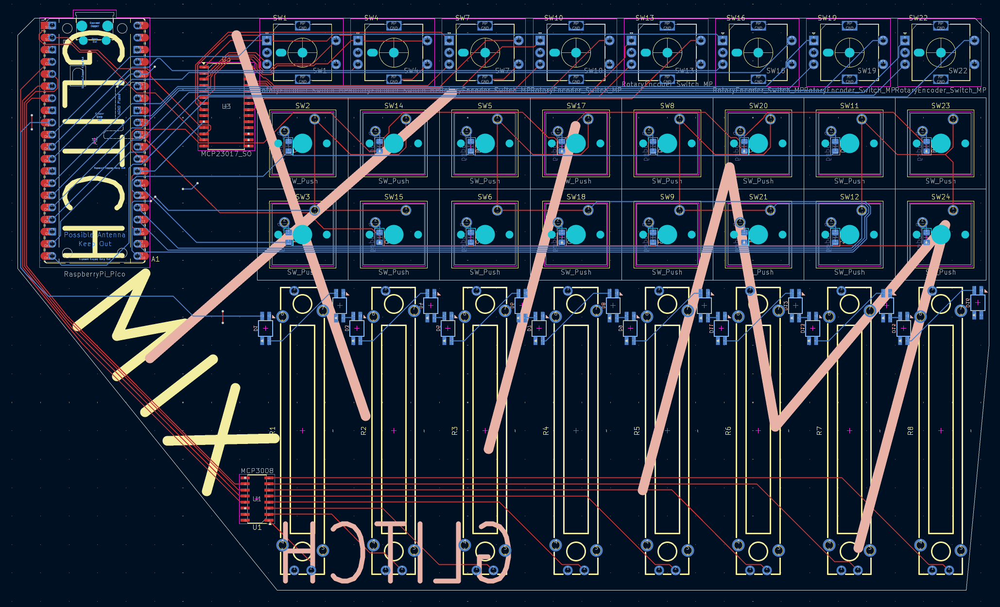
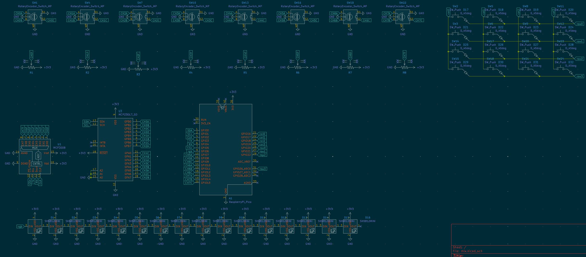

# Mix
A multipurpose audio-focused console

## Why
I find myself constantly tuning my audio mix from different apps through windows, and would like a panel to adjust levels on the fly. I also wanted to use this for mixing audio for music and video projects, so I included 8 channels. Each channel has a slider for feed volume, an encoder for monitoring volume, a solo button, and a mute button. Everything is remappable to select functions for your usecase. I also included 2 neopixels per channel, one for status, and one for leveling by color.

## Assembly
Like [Timeline](https://github.com/justaglitchfl/timeline), no case for this one, as I want that raw PCB aesthetic. Solder everything together, good luck with the SMD for the ADC and IO expander! Might do a case when I get to uni and have access to actually functional printers if I get tired of the pcb as is. As with my other projects recently, drop some 3M 2229 on the back to protect it/the table, and to keep it in place (I love this stuff).

## BOM
|q  |part             |link                                                     |price       |total |
|---|-----------------|---------------------------------------------------------|------------|------|
|1  |pcb              |                                                         |$42.60      |$102.80|
|16 |switches         |                                                         |have on hand|      |
|8  |ECE11            |https://lcsc.com/product-detail/Rotary-Encoders_ALPSALPINE-EC11E18244AU_C202365.html|$15.71      |      |
|8  |slide potentiometer|https://lcsc.com/product-detail/Potentiometers-Variable-Resistors_BOURNS-PTA4543-2015DPB103_C17444183.html?s_z=n_%25C2%25B120%2525%2520250mW%252010k%25CE%25A9%2520Through%2520Hole%2520Potentiometers%252C%2520Variable%2520Resistors%2520ROHS|$14.16      |      |
|1  |MCP23017_SO      |https://lcsc.com/product-detail/I-O-Expanders_MICROCHIP-MCP23017T-E-SO_C629440.html?s_z=n_MCP23017_SO|$1.94       |      |
|1  |MCP3008          |https://lcsc.com/product-detail/Analog-to-Digital-Converters-ADC_MICROCHIP-MCP3008T-I-SL_C2651321.html?s_z=n_mcp3008|$3.30       |      |
|16 |0805 signal diode|                                                         |have on hand|      |
|16 |sk6812 mini e    |                                                         |have on hand|      |
|1  |pi pico usbc (i wan orph pico)|https://www.aliexpress.us/item/3256807183354679.html?spm=a2g0o.productlist.main.5.7a7f3de52hAPEA&algo_pvid=1f0d5b04-b26a-48e7-9a46-02294e034b27&algo_exp_id=1f0d5b04-b26a-48e7-9a46-02294e034b27-4&pdp_ext_f=%7B%22order%22%3A%2284%22%2C%22eval%22%3A%221%22%7D&pdp_npi=4%40dis%21USD%212.56%212.56%21%21%212.56%212.56%21%402101ef5e17540194226302590e807a%2112000040462155654%21sea%21US%216129401916%21X&curPageLogUid=bwr0jMqPdQNe&utparam-url=scene%3Asearch%7Cquery_from%3A|$3.56       |      |
|1  |lcsc s+h         |                                                         |$21.53      |      |
