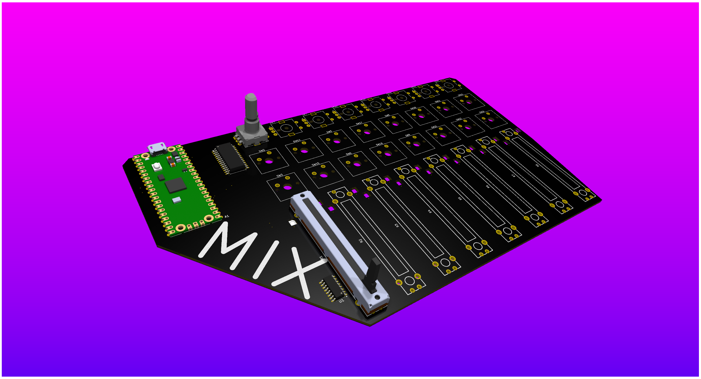

Total Hours: 13
---
title: "Mix"
author: "rowyn"
description: "A multifunctional digital audio mixing console"
created_at: "2024-06-6"
---

## Getting it started: 7/8
Hours: 3
Thought up the general concept; started a schematic

## Getting it done: 7/9
Hours: 5
Planned implementation, researched IO expanders and ADCs, finished schematic, made pcb. I chose not to make a case here, as my printer is currently having issues, and I am kind of a fan of the raw pcb aesthetic regardless.

## Getting it done pt 2: 7/10
Finishing everything from the previous night
Hours: 4

## Realizing some issues: 7/31
Turns out some of the parts I initially selected were out of stock on LCSC, so I had to speedrun redoing part of the schematic, PCB, and adding the 3d models in the little bit of time I had throughout the day. I ended up getting it submitted at 11:59 PM EST, in the last few seconds before the deadline. I also added the 3d models of as many parts as I could (just one of each for limited time). I got the BOM finished, all the images saved, wrote a README, and submitted all in slightly less than an hour (locked tf in).
Hours: 1

